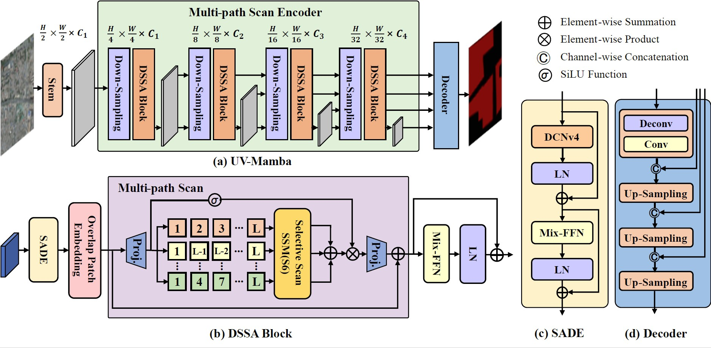
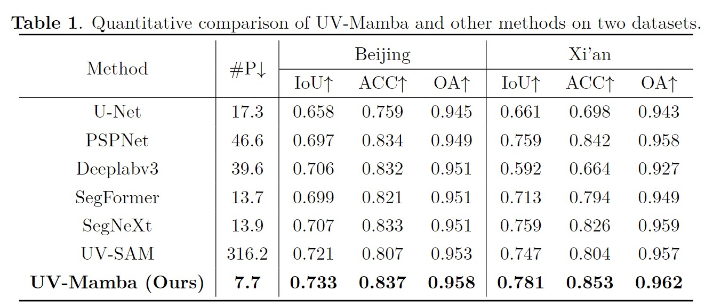
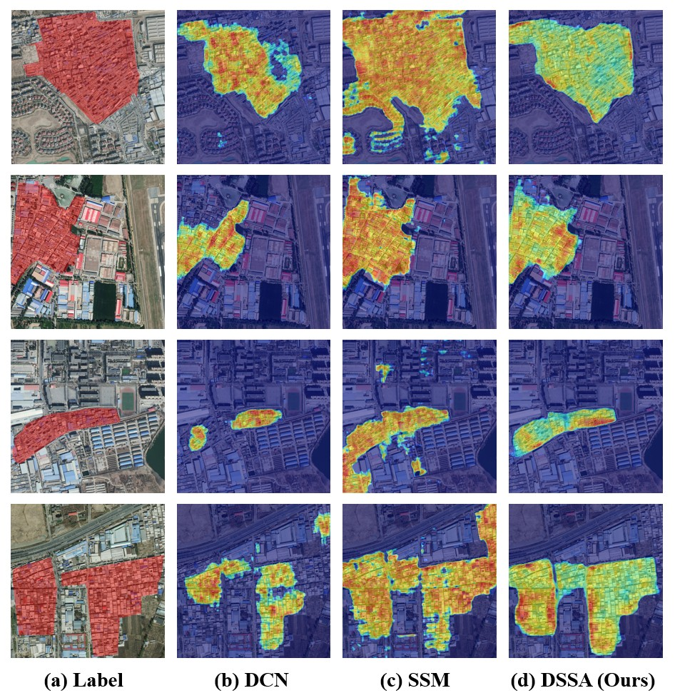
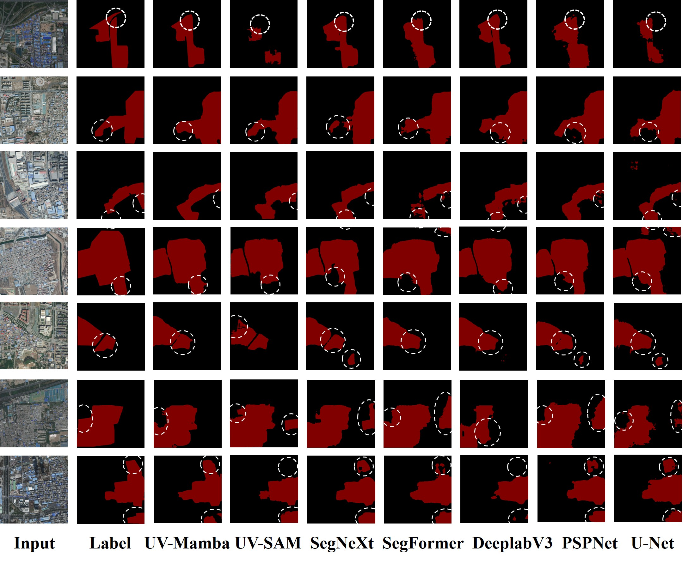

<p align="center">
<h1 align="center">UV-Mamba: A DCN-Enhanced State Space Model for Urban Village Boundary Identification inHigh-Resolution Remote Sensing Images</h1>

<p align="center">
    <a href="https://blog.csdn.net/qq_42951560">Lulin Li<sup>1,*</sup></a>,
    <a href="https://cslikai.cn/">Ben Chen<sup>1,*</sup></a>,
    <a href="https://blog.csdn.net/qq_42951560">Xuechao Zou<sup>2,*</sup></a>,
    <a href="https://www.cs.tsinghua.edu.cn/info/1116/5088.htm">Junliang Xing<sup>3</sup></a>,
    <a href="https://www.cs.tsinghua.edu.cn/info/1117/3542.htm">Pin Tao<sup>1,3,†</sup></a>
</p>

<p align="center">
    <a href="https://www.qhu.edu.cn/">Qinghai University</a><sup>1</sup>
    •
    <a href="https://www.tsinghua.edu.cn/">Beijing Jiaotong University</a><sup>2</sup>    
    •    
    <a href="https://www.tsinghua.edu.cn/">Tsinghua University</a><sup>3</sup>
  </p>
  <p align="center">
    <a href="https://arxiv.org/abs/2409.03431">Paper Preprint </a>
    |
    <a href="devin-egber.github.io/UV-Mamba/">Project Page</a>
</p>


<p align="center">
    
</p>

## Abstract

Due to the diverse geographical environments, intricate landscapes, and high-density settlements, 
the automatic identification of urban village boundaries using remote sensing images remains a highly challenging task. 
This paper proposes a novel and efficient neural network model called UV-Mamba for accurate boundary detection in high-resolution remote sensing images. 
UV-Mamba mitigates the memory loss problem in lengthy sequence modeling, which arises in state space models with increasing image size, by incorporating deformable convolutions. 
Its architecture utilizes an encoder-decoder framework and includes an encoder with four deformable state space augmentation blocks for efficient multi-level semantic extraction and a decoder to integrate the extracted semantic information.
We conducted experiments on two large datasets showing that UV-Mamba achieves state-of-the-art performance. 
Specifically, our model achieves 73.3% and 78.1% IoU on the Beijing and Xi'an datasets, respectively, representing improvements of 1.2% and 3.4% IoU over the previous best model while also being 6× faster in inference speed and 40× smaller in parameter count.

## Installation

clone the repository

```bash
git clone https://github.com/Devin-Egber/UV-Mamba.git && cd UV-Mamba
conda env create -f uvmamba.yml
conda activate uvmamba
```


## Datasets Preparation

The structure of datasets are aligned as follows:

```
├── Beijing or Xi'an
│   ├── img_dir
│   │   ├── train
│   │   ├── val
│   │   ├── test
│   ├── ann_dir
│   │   ├── train
│   │   ├── val
│   │   ├── test
```


## Training

We use 1 GPU for training by default. Make sure you have modified the `dataset_folder` variable in [uv_mamba_cityscapes.yaml](config/uv/uvmamba_cityscapes.yaml) , [uvmamba_beijing.yaml](config/uv/uvmamba_beijing.yaml) and  [uvmamba_xian.yaml](config/uv/uvmamba_beijing.yaml).    

First: pretrain ```UV-Mamba``` on ```Cityscapes```:

```bash
bash tools/pretrain.sh
```
Second: finetune ```UV-Mamba``` on ```Beijing``` or ```Xi'an``` dataset:

```bash
bash tools/train.sh
```

## Evaluation
To evaluate the model. Make sure you have modified the `dataset_folder` variable in [uvmamba_beijing.yaml](config/uv/uvmamba_beijing.yaml) or [uvmamba_xian.yaml](config/uv/uvmamba_beijing.yaml).    

Example: evaluate ```UV-Mamba``` on ```Beijing```:

```bash
bash tools/test.sh
```

## Results
<p align="center">
    
</p>

## Class Activation Map
<p align="center">
    
</p>


## Segmentation Visualization
<p align="center">
    
</p>


## LICENSE

This repo is under the Apache-2.0 license. For commercial use, please contact the authors. 


