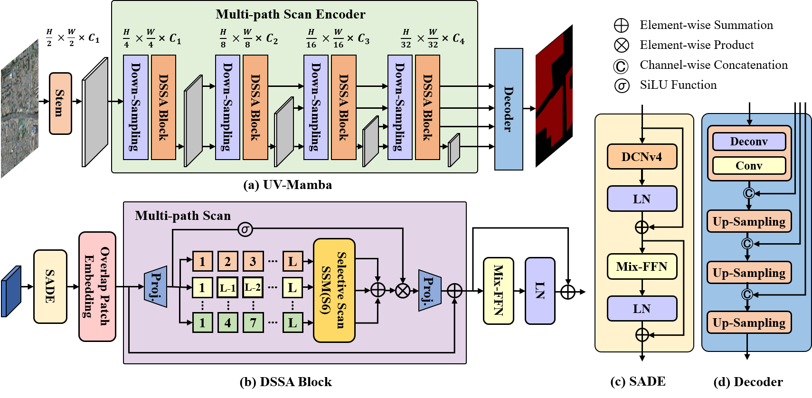

# UV-Mamba: A DCN-Enhanced State Space Model for Urban Village Boundary Identification inHigh-Resolution Remote Sensing Images

<p align="center">
    
</p>

## Abstract

This paper proposes a novel and efficient neural network model called UV-Mamba for accurate boundary detection in high-resolution remote sensing
images. UV-Mamba mitigates the memory loss problem in long
sequence modeling, which arises in state space model (SSM) with
increasing image size, by incorporating deformable convolutions
(DCN). Its architecture utilizes an encoder-decoder framework
and includes an encoder with four deformable state space
augmentation blocks for efficient multi-level semantic extraction
and a decoder to integrate the extracted semantic information.


## Installation

clone the repository

```bash
git clone https://github.com/Devin-Egber/UV-Mamba.git && cd UV-Mamba
conda env create -f uvmamba.yml
conda activate uvmamba
```


## Datasets Preparation

The structure of datasets are aligned as follows:

```
├── Beijing or Xi'an
│   ├── img_dir
│   │   ├── train
│   │   ├── val
│   │   ├── test
│   ├── ann_dir
│   │   ├── train
│   │   ├── val
│   │   ├── test
```


## Training

We use 1 GPU for training by default. Make sure you have modified the `dataset_folder` variable in [uv_mamba_cityscapes.yaml](config/uv/uvmamba_cityscapes.yaml) , [uvmamba_beijing.yaml](config/uv/uvmamba_beijing.yaml) and  [uvmamba_xian.yaml](config/uv/uvmamba_beijing.yaml).    

First: pretrain ```UV-Mamba``` on ```Cityscapes```:

```bash
bash tools/pretrain.sh
```
Second: finetune ```UV-Mamba``` on ```Beijing``` or ```Xi'an``` dataset:

```bash
bash tools/train.sh
```

## Evaluation
To evaluate the model. Make sure you have modified the `dataset_folder` variable in [uvmamba_beijing.yaml](config/uv/uvmamba_beijing.yaml) or [uvmamba_xian.yaml](config/uv/uvmamba_beijing.yaml).    

Example: evaluate ```UV-Mamba``` on ```Beijing```:

```bash
bash tools/test.sh
```

## LICENSE

This repo is under the Apache-2.0 license. For commercial use, please contact the authors. 


